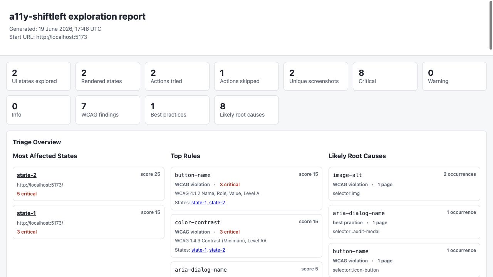
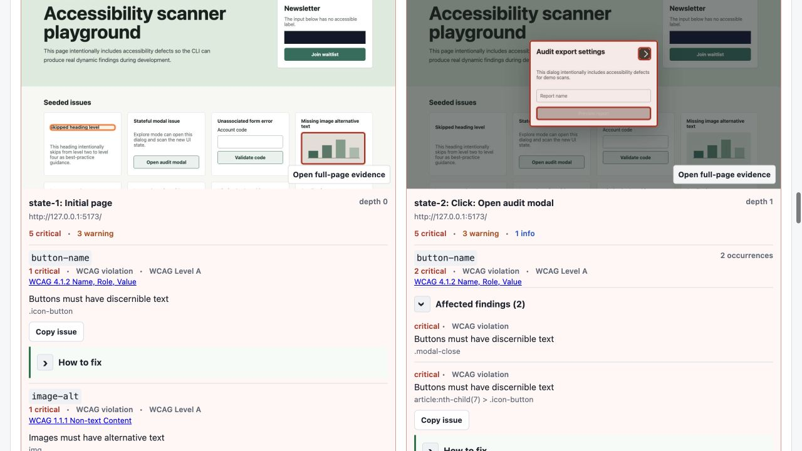

# a11y-shiftleft-cli

[](https://github.com/olboyarshinova/a11y-shiftleft-cli/actions/workflows/quality.yml)
[](https://github.com/olboyarshinova/a11y-shiftleft-cli/actions/workflows/a11y.yml)
[](https://www.npmjs.com/package/a11y-shiftleft-cli)

[Install from npm](https://www.npmjs.com/package/a11y-shiftleft-cli):
`npm install --save-dev a11y-shiftleft-cli`

One command for visual accessibility reports in web apps.

`a11y-shiftleft-cli` helps teams find accessibility issues before they ship. Run
`audit`, point it at a local or preview URL, and get a visual HTML report with
screenshots, WCAG metadata, keyboard evidence, user-impact labels, and fix
guidance.

Dynamic browser checks work with any rendered website available at a local or
preview URL, regardless of whether it was built with React, Vue, Angular,
Next.js, Svelte, Astro, Rails, Django, or static HTML. Optional static adapters
are currently available only for React, Vue, and Angular.

## 2-Minute Quick Start

Use this when your app already runs locally.

1. Install the CLI:

```bash
npm install --save-dev a11y-shiftleft-cli
npx playwright install chromium
```

The examples below use the published package name
`npx a11y-shiftleft-cli`. After local installation, the shorter
`npx a11y-shiftleft` alias also works inside the project.

2. Start your app in another terminal:

```bash
npm run dev
```

Common dev server URLs by framework or tool:

| Framework / Tool | Default URL |
|---|---|
| Vite (React, Vue, Svelte) | `http://localhost:5173` |
| Next.js | `http://localhost:3000` |
| Create React App | `http://localhost:3000` |
| Angular CLI | `http://localhost:4200` |
| Astro | `http://localhost:4321` |
| Webpack Dev Server | `http://localhost:8080` |

When in doubt, use the URL your terminal prints after `npm run dev`.

3. Run your first audit. Replace the URL with the URL printed by your dev server:

```bash
npx a11y-shiftleft-cli audit --url http://localhost:5173 --out reports
```

The command combines available static analysis, browser exploration, axe
checks, a bounded keyboard traversal, screenshots, and a manual-review
checklist. Safe mode blocks recognized payment, account, cookie-consent,
permission, advertising, and other high-risk controls.

The audit writes screenshots while browser exploration is running. The combined
`reports/a11y-report.html` file is created after exploration, keyboard checks,
and report processing finish. Wait for the terminal to print `Open:
reports/a11y-report.html` before opening the final report.

4. Open the visual report:

```bash
# macOS
open reports/a11y-report.html

# Linux
xdg-open reports/a11y-report.html

# Windows PowerShell
start reports/a11y-report.html
```

The default audit stays compact:

```txt
reports/a11y-report.html
reports/a11y-report.json
reports/a11y-comment.md
reports/evaluation-scope.json
reports/screenshots/
```

Add `--excel` for four structured CSV tables, `--pdf` for a portable visual
report, or `--raw` for the exploration graph. These files are optional so a
normal local audit remains easy to navigate.

### If The Audit Fails

Make sure your app is still running, then ask the CLI to check the local setup:

```bash
npx a11y-shiftleft-cli doctor --url http://localhost:5173
```

If Chromium is missing, install the browser used by Playwright:

```bash
npx playwright install chromium
```

## What It Does

Most accessibility tools solve one part of the workflow:

- axe-core finds browser-rendered issues.
- ESLint plugins catch framework-specific patterns.
- Lighthouse gives a familiar page-level score when enabled, but it is not a
  WCAG conformance certificate.
- CI tells you whether a pull request should pass.

This project turns those pieces into one repeatable developer workflow:

- Start with one command: `audit`.
- Review one visual HTML report with screenshots, WCAG metadata, user impact,
  and recommendations.
- Use `check` later when you need a faster CI/PR gate.
- Keep advanced workflows available without making the first run complicated.

## See The Visual Report

The `audit` command creates one local HTML report with summary metrics,
WCAG-aware triage, likely root causes, screenshots, keyboard evidence, manual
review steps, and fix recommendations. It safely discovers UI states, including
opened dialogs with annotated accessibility findings.

[](docs/assets/demo-report-overview.png)

[](docs/assets/demo-report-states.png)

## Built On Trusted Tools

The current CLI combines established open-source tools instead of replacing
their rule engines:

- [axe-core through `@axe-core/playwright`](https://www.npmjs.com/package/@axe-core/playwright)
  runs automated accessibility rules against the rendered page.
- [Playwright](https://playwright.dev/) drives Chromium, explores bounded UI
  states, captures screenshots, and collects keyboard and accessibility-tree
  evidence.
- [ESLint](https://eslint.org/) powers source checks through optional adapters
  for [`eslint-plugin-jsx-a11y`](https://www.npmjs.com/package/eslint-plugin-jsx-a11y),
  [`eslint-plugin-vue`](https://www.npmjs.com/package/eslint-plugin-vue), and
  [Angular ESLint](https://www.npmjs.com/package/@angular-eslint/eslint-plugin-template).

[Lighthouse](https://developer.chrome.com/docs/lighthouse/overview/) is optional
and not bundled by default. Add `lighthouse` to a project and run
`audit --with-lighthouse` or `check --with-lighthouse` when teams want its
familiar accessibility score alongside detailed axe, keyboard, and source
findings. Reports also show where Lighthouse and the a11y-shiftleft pipeline
agree or disagree by rule ID, plus Lighthouse descriptions and documentation
links for failed and manual audits.

## Optional Setup

After the first audit works, create a config file and add generated reports to
`.gitignore`:

```bash
npx a11y-shiftleft-cli init --framework auto --gitignore
```

You can use a URL shortcut in your terminal. The examples below use macOS/Linux
shell syntax:

```bash
export APP_URL=http://localhost:5173
npx a11y-shiftleft-cli doctor --url $APP_URL
npx a11y-shiftleft-cli audit --url $APP_URL --out reports
```

In Windows PowerShell, set `$env:APP_URL = "http://localhost:5173"` and use
`$env:APP_URL` in place of `$APP_URL`. You can also avoid environment variables
and pass the URL directly on every operating system.

`APP_URL` is only a shortcut. You can always pass the URL directly:

```bash
npx a11y-shiftleft-cli audit --url http://localhost:4200 --out reports
```

## Common Commands

Use `audit` first. It produces the visual HTML report and includes the checks
most teams need for local review.

| Goal | Command | Main output |
|---|---|---|
| Run the recommended audit | `npx a11y-shiftleft-cli audit --url $APP_URL --out reports` | `a11y-report.html` |
| Run and open the report | `npx a11y-shiftleft-cli audit --url $APP_URL --out reports --open` | Visual report opened automatically |
| Audit a slower application | `npx a11y-shiftleft-cli audit --url $APP_URL --wait-ms 1000 --out reports` | Visual report after an extra settle wait |
| Show only WCAG-mapped findings | `npx a11y-shiftleft-cli audit --url $APP_URL --wcag-only --out reports` | Report without best-practice or unmapped review signals |
| Skip screenshots for private data | `npx a11y-shiftleft-cli audit --url $APP_URL --no-screenshots --out reports` | Report without images |
| Add optional Lighthouse score | `npm install --save-dev lighthouse && npx a11y-shiftleft-cli audit --url $APP_URL --with-lighthouse --out reports` | Visual report plus score and rule comparison |
| Add Excel and PDF exports | `npx a11y-shiftleft-cli audit --url $APP_URL --out reports --excel --pdf` | HTML, CSV, and PDF |

### CI And Pull Requests

Use `check` when speed and machine-readable output matter more than screenshots.
It writes JSON, Markdown, and optional CSV reports; it does not create a visual
HTML report.

| Goal | Command | Main output |
|---|---|---|
| Run a fast browser scan | `npx a11y-shiftleft-cli check --dynamic --url $APP_URL --out reports` | JSON and Markdown |
| Run static source checks only | `npx a11y-shiftleft-cli check --static --out reports` | JSON and Markdown |
| Scan several known pages | `npx a11y-shiftleft-cli check --dynamic --url $APP_URL $APP_URL/settings $APP_URL/checkout --out reports` | Combined non-visual report |
| Discover same-origin pages | `npx a11y-shiftleft-cli check --dynamic --url $APP_URL --crawl --crawl-depth 1 --crawl-limit 10 --out reports` | Bounded crawl results |
| Compare only new findings | `npx a11y-shiftleft-cli check --url $APP_URL --baseline --out reports` | Baseline comparison |
| Add optional Lighthouse comparison | `npm install --save-dev lighthouse && npx a11y-shiftleft-cli check --url $APP_URL --with-lighthouse --out reports` | axe findings plus Lighthouse score |

Lighthouse is optional so the default package stays lightweight. Both `audit`
and `check` can store the Lighthouse accessibility score, failed audits, manual
Lighthouse checks, rule-level comparison evidence, and Lighthouse guidance links.
Treat this as a useful signal for teams and designers, not as WCAG conformance
proof.

### Advanced Tools

You usually do not need these for the first run.

| Goal | Command | Use it for |
|---|---|---|
| Verify local setup | `npx a11y-shiftleft-cli doctor --url $APP_URL` | Framework, adapter, browser, and URL diagnostics |
| Explore visual UI states only | `npx a11y-shiftleft-cli explore --url $APP_URL --depth 2 --out reports` | Lower-level screenshot/state exploration |
| Audit only keyboard focus | `npx a11y-shiftleft-cli keyboard --url $APP_URL --out reports/keyboard` | Focus order and keyboard evidence |
| Generate a VoiceOver smoke checklist | `npx a11y-shiftleft-cli screen-reader --profile voiceover --url $APP_URL --out reports/screen-reader` | Manual screen-reader test protocol |
| Create planned audit scope | `npx a11y-shiftleft-cli scope init --url $APP_URL --product-type "web application"` | Larger audit planning |
| Refresh reports while coding | `npx a11y-shiftleft-cli watch --url $APP_URL --out reports/watch` | Local development feedback |
| Generate GitHub Actions workflows | `npx a11y-shiftleft-cli ci --url $APP_URL --start-command "npm run dev"` | Pull-request and scheduled CI |
| View historical trends | `npx a11y-shiftleft-cli dashboard --reports reports` | Local metrics dashboard |

## What The Reports Mean

After an audit, start with `reports/a11y-report.html`. It combines visual states,
annotated screenshots, severity and WCAG metadata, fix recommendations, keyboard
evidence, user-impact labels, and the manual checks that automation cannot
complete.

Each finding is labeled as a `WCAG violation`, `best practice`, or
`unmapped review`. Reports group repeated occurrences, mark known third-party
embeds, call out human-verification blockers, and separate automated evidence
from manual review tasks.

For a quick public-site example, replace `https://example.com` with a site you
are authorized to scan:

```bash
npx a11y-shiftleft-cli audit --url https://example.com --out reports
```

The top-level report summary includes ownership and human-verification counts
so these cases are visible before reviewing individual findings.

| File | Use it for | Commit it? |
|---|---|---|
| `reports/a11y-report.html` | Primary visual review | Usually no |
| `reports/a11y-comment.md` | Human review and PR comments | Usually no |
| `reports/a11y-report.json` | Automation, debugging, integrations | Usually no |
| `reports/evaluation-scope.json` | Reproducibility scope inspired by WCAG-EM | Usually no |
| `reports/screenshots/` | Screenshots from visual exploration | No |
| `reports/a11y-summary.csv` | Optional Excel summary from `audit --excel` | Usually no |
| `reports/a11y-pages.csv` | Optional page table from `audit --excel` | Usually no |
| `reports/a11y-rules.csv` | Optional rule table from `audit --excel` | Usually no |
| `reports/a11y-findings.csv` | Optional finding table from `audit --excel` | Usually no |
| `reports/a11y-report.pdf` | Optional portable report from `audit --pdf` | Usually no |
| `reports/exploration-graph.json` | Optional debugging data from `audit --raw` | Usually no |
| `.a11y-shiftleft.json` | Shared project config | Usually yes |
| `.a11y-baseline.json` | Accepted known findings | Yes, when using baseline mode |
| `a11y-ignore.json` | Temporary reviewed exceptions | Yes, when intentionally used |

Severity answers: "How risky is this finding?"

Confidence answers: "How strong is the tool evidence?"

User impact answers: "Who is likely affected in practice?" Reports use a
compact `blocker`, `significant`, `workaround`, or `minor` label plus affected
user groups such as keyboard users, screen reader users, voice-control users,
or low-vision users.

For axe `color-contrast` findings, JSON, Markdown, and visual reports include
the measured and required ratios, text and background colors, font metadata,
and deterministic suggestions that meet the reported threshold. Treat suggested
colors as starting points and verify shared design tokens and interactive states.

When a dynamic run checks multiple pages, the CLI also compares document
titles. It reports common starter placeholders such as `Vite + React` and titles
reused across distinct URLs, while repeated dialogs, themes, and other states of
the same URL are not treated as duplicate pages.

## Advanced Workflows

The first run should be `audit`. Use these workflows only when you need a
specific job:

| Workflow | Use it for | Read more |
|---|---|---|
| Static adapters | React, Vue, and Angular source checks | [Recipes](docs/recipes/index.md) |
| Visual exploration | Lower-level screenshot and state debugging | [Visual reports](docs/visual-reports.md) |
| Watch mode | Local feedback while coding | [Watch mode](docs/watch-mode.md) |
| Baselines and ignores | Adopt existing projects without blocking on old findings | [Configuration](docs/configuration.md) |
| GitHub Actions | Pull-request and scheduled CI workflows | [GitHub Actions recipe](docs/recipes/github-actions.md) |
| Keyboard focus | Standalone focus traversal and activation checks | [Keyboard focus audit](docs/keyboard-audit.md) |
| Manual review | Screen-reader and human-review checklists | [WCAG coverage](docs/wcag-coverage.md) |
| Dashboard | Trend review across saved runs | [Configuration](docs/configuration.md) |
| Ticket drafts | Dry-run Jira, Linear, or generic issue drafts | [Ticket export](docs/ticket-export.md) |
| Evidence and sharing | Local evidence packages and sanitized review copies | [Report sharing](docs/report-sharing.md) |

Automated reports do not certify full WCAG, ADA, or Section 508 conformance.
Use them with manual keyboard review, screen-reader checks, content review, and
your organization's compliance process.

## Troubleshooting

If a scan fails because of Node, Playwright, Chromium, config, or a target URL,
run:

```bash
npx a11y-shiftleft-cli doctor --url $APP_URL
```

For CI or scripts:

```bash
npx a11y-shiftleft-cli check --dynamic --url $APP_URL --json-summary --out reports
npx a11y-shiftleft-cli check --dynamic --url $APP_URL --quiet --out reports
npx a11y-shiftleft-cli check --dynamic --url $APP_URL --verbose --out reports
```

## Local Demo

This repository includes a React/Vite demo with intentional accessibility
defects.

```bash
nvm use
npm install
npm run demo -- --port 5173
```

In another terminal:

```bash
nvm use
node bin/cli.js audit --url http://localhost:5173 --out reports
```

## More Documentation

- [FAQ](docs/faq.md): Common questions about installing, running, and reading reports.
- [Recipes](docs/recipes/index.md): React, Vue, Angular, Next.js, multiple URL
  scans, GitHub Actions, ADA Title II, and Section 508 setup guides.
- [Configuration](docs/configuration.md): config files, `.gitignore`,
  baseline files, ignores, cleanup, and retention.
- [Visual reports](docs/visual-reports.md): screenshot privacy, safe mode, and
  advanced `explore` options.
- [Report sharing](docs/report-sharing.md): GitHub Actions artifacts, privacy
  review, and sanitized local exports.
- [Keyboard focus audit](docs/keyboard-audit.md): bounded Tab traversal,
  generated focus-path evidence, and current limitations.
- [Watch mode](docs/watch-mode.md): local development feedback after file
  changes.
- [Ticket export](docs/ticket-export.md): dry-run Jira, Linear, or generic
  ticket drafts from `a11y-report.json`.
- [Evidence methodology](docs/evidence-methodology.md): confidence scoring,
  issue categories, false-positive review, and metrics definitions.
- [WCAG 2.2 coverage](docs/wcag-coverage.md): criterion-by-criterion automated,
  manual, and missing coverage.
- [Empirical validation](docs/empirical-validation.md): baseline vs
  intervention study design and analysis commands.
- [Adoption strategy](docs/adoption-strategy.md): npm scripts, generated CI,
  future GitHub Action wrapper, docs-site plan, and outreach ideas.
- [Roadmap](docs/roadmap.md): Lighthouse comparison, browser overlay,
  dashboard improvements, and future tracker integrations.
- [Contributing](CONTRIBUTING.md): first PR path, local setup, testing, issue
  templates, and pull request checklist.
- [GitHub About setup](docs/github-about.md): recommended repository
  description, website, and topics.

## Release Notes

Current release:

- [v0.8.0](docs/release-notes-v0.8.0.md)

Previous releases:

- [v0.7.0](docs/release-notes-v0.7.0.md)
- [v0.6.3](docs/release-notes-v0.6.3.md)
- [v0.6.2](docs/release-notes-v0.6.2.md)
- [v0.6.1](docs/release-notes-v0.6.1.md)
- [v0.6.0](docs/release-notes-v0.6.0.md)
- [v0.5.2](docs/release-notes-v0.5.2.md)
- [v0.5.1](docs/release-notes-v0.5.1.md)
- [v0.5.0](docs/release-notes-v0.5.0.md)
- [v0.4.0](docs/release-notes-v0.4.0.md)
