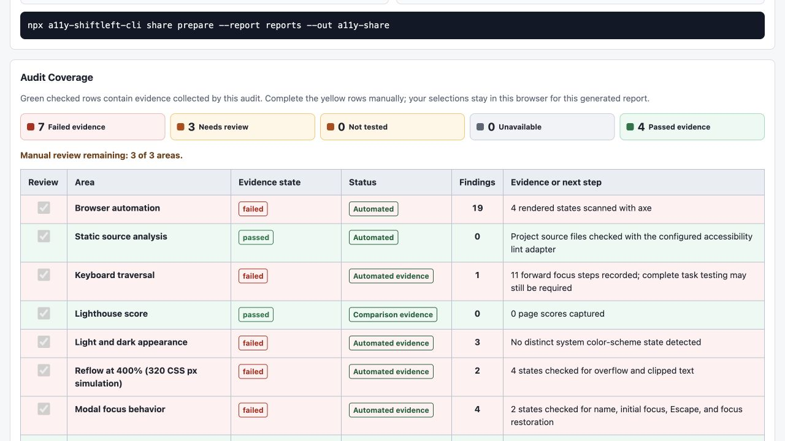

# a11y-shiftleft-cli

[](https://github.com/olboyarshinova/a11y-shiftleft-cli/actions/workflows/quality.yml)
[](https://github.com/olboyarshinova/a11y-shiftleft-cli/actions/workflows/a11y.yml)
[](https://www.npmjs.com/package/a11y-shiftleft-cli)

Visual accessibility audit reports for web apps.

[npm package](https://www.npmjs.com/package/a11y-shiftleft-cli)

Run one command against a local, staging, or preview URL. The CLI opens your page
in Chromium, checks it with trusted accessibility tools, and creates a local HTML
report with screenshots, WCAG labels, keyboard evidence, and fix guidance.

It works with any rendered website: React, Vue, Angular, Next.js, Svelte, Astro,
Rails, Django, static HTML, and others. Optional source-code adapters are
currently available for React, Vue, and Angular.

## Quick Start

Use this when your app already runs locally. You need Node.js 18 or newer, but
you do not need to configure a framework first.

1. Install the CLI and the Chromium browser used by Playwright:

```bash
npm install --save-dev a11y-shiftleft-cli
npx playwright install chromium
```

2. Start your app in another terminal:

```bash
npm run dev
```

3. Run your first visual audit. Replace the URL with the one printed by your dev
   server:

```bash
npx a11y-shiftleft-cli audit --url http://localhost:5173 --out reports --open
```

4. If the report does not open automatically:

```bash
open reports/a11y-report.html
```

On Linux use `xdg-open reports/a11y-report.html`. On Windows PowerShell use
`start reports/a11y-report.html`.

The command saves screenshots while it runs. Wait for the terminal to print the
final `Open:` path before reviewing the report.

Optional: after the first local audit works, generate a GitHub Actions workflow:

```bash
npx a11y-shiftleft-cli ci --url http://localhost:5173 --start-command "npm run dev"
```

## What You Get

- A local visual HTML report you can open in your browser.
- Annotated screenshots that show where issues were found.
- WCAG A/AA labels, severity, confidence, and user-impact hints.
- Fix guidance, including contrast ratios and color suggestions.
- Keyboard evidence and manual-review tasks for things automation cannot prove.

## See The Visual Report

This is the main output of `audit`:

[](docs/assets/demo-report-overview.png)

[](docs/assets/demo-report-coverage.png)

[](docs/assets/demo-report-states.png)

## Which Command Should I Use?

Start with `audit`. Use `check` later for faster CI/PR checks.

| Need | Command |
|---|---|
| First local review | `npx a11y-shiftleft-cli audit --url http://localhost:5173 --out reports --open` |
| Fast CI or PR check | `npx a11y-shiftleft-cli check --dynamic --url http://localhost:5173 --out reports` |
| Diagnose setup problems | `npx a11y-shiftleft-cli doctor --url http://localhost:5173` |
| Add config and report paths to `.gitignore` | `npx a11y-shiftleft-cli init --framework auto --gitignore` |
| Generate GitHub Actions workflow files | `npx a11y-shiftleft-cli ci --url http://localhost:5173 --start-command "npm run dev"` |

Use `explore` only when you want to debug visual state discovery without the full
audit workflow.

By default, `audit` explores up to 2 interaction levels from the start page.
`--max-depth` lets you change that safety limit; it does not mean "scan forever"
or "visit every possible page."

```bash
npx a11y-shiftleft-cli audit --url http://localhost:5173 --max-depth 1 --out reports
npx a11y-shiftleft-cli audit --url http://localhost:5173 --max-depth 3 --limit 50 --out reports
```

Use `1` for a quick smoke test, the default `2` for most local reviews, and `3`
or more only when you intentionally want a broader scan.

If the first audit fails, run:

```bash
npx a11y-shiftleft-cli doctor --url http://localhost:5173
```

After the report opens:

1. Start with the "Fix First" and screenshot sections.
2. Check the manual-review tasks for keyboard, screen reader, content, and forms.
3. Re-run the same command after fixing issues.

Reports and screenshots usually should not be committed. Run `init --gitignore`
once to add common report paths. For private pages, add `--no-screenshots`.

## Built On

The CLI orchestrates established tools instead of replacing their rule engines:

- axe-core through [`@axe-core/playwright`](https://www.npmjs.com/package/%40axe-core%2Fplaywright)
  runs automated accessibility rules against the rendered page.
- [Playwright](https://playwright.dev/) drives Chromium, explores bounded UI
  states, captures screenshots, and collects keyboard and accessibility-tree
  evidence.
- [ESLint](https://eslint.org/) powers optional source checks for React, Vue,
  and Angular.
- [Lighthouse](https://developer.chrome.com/docs/lighthouse/overview/) can be
  enabled with `--with-lighthouse` when teams want its familiar accessibility
  score alongside detailed findings.

## Coverage And Limits

- Automated reports do not certify full WCAG, ADA, or Section 508 conformance.
- Use the report with manual keyboard, screen-reader, content, and task-flow
  review.
- Some public websites block automated scans with bot detection or CAPTCHA.
- Third-party embeds such as YouTube, Vimeo, Spotify, Google Maps, and CodePen
  are marked separately when ownership can be detected.

<details>
<summary>Run the local demo</summary>

This repository includes a React/Vite demo with intentional accessibility
defects.

```bash
nvm use
npm install
npm run demo -- --port 5173
```

In another terminal:

```bash
nvm use
node bin/cli.js audit --url http://localhost:5173 --out reports
```

</details>

## Learn More

- [FAQ](docs/faq.md)
- [Recipes](docs/recipes/index.md)
- [Configuration](docs/configuration.md)
- [Visual reports](docs/visual-reports.md)
- [Report sharing and privacy](docs/report-sharing.md)
- [Keyboard focus audit](docs/keyboard-audit.md)
- [WCAG 2.2 coverage](docs/wcag-coverage.md)
- [Evidence methodology](docs/evidence-methodology.md)
- [Roadmap](docs/roadmap.md)
- [Contributing](CONTRIBUTING.md)
