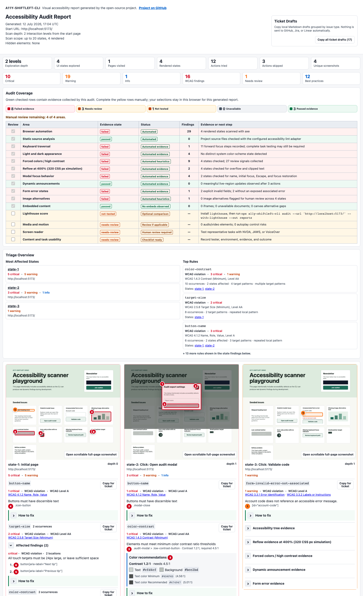

# a11y-shiftleft-cli

[](https://github.com/olboyarshinova/a11y-shiftleft-cli/actions/workflows/quality.yml)
[](https://github.com/olboyarshinova/a11y-shiftleft-cli/actions/workflows/a11y.yml)
[](https://www.npmjs.com/package/a11y-shiftleft-cli)
[](https://nodejs.org/)

Catch accessibility issues while you code, not after release.

`a11y-shiftleft-cli` is a local-first, shift-left accessibility audit tool for
frontend developers who are not accessibility specialists. Run one command
against a local, staging, or preview URL. It opens your app in a browser,
safely explores UI states, deduplicates overlapping WCAG-oriented findings, and
generates a visual HTML report with screenshots, keyboard evidence, grouped
issues, and practical fix guidance.

Use it locally during development or add it to CI/CD so pull requests get
repeatable accessibility feedback before issues reach production.

It works with any rendered web app or website, including React, Vue, Angular,
Next.js, Svelte, Astro, Rails, Django, and static HTML. Optional source-code
adapters add framework-aware checks for React, Vue, and Angular. For SPAs and
dynamic pages, the browser audit checks the rendered UI after client-side data
loads, not just the initial HTML source.

## Why It Helps

- Replaces several separate review steps with one developer-friendly workflow.
- Turns raw rule output into grouped, prioritized findings.
- Helps developers understand what to fix without becoming accessibility
  specialists first.
- Lets teams start report-only, then tighten CI gates after they understand the
  findings.

## Built On Known Tools

The CLI orchestrates established tools instead of replacing their rule engines:
axe-core through [`@axe-core/playwright`](https://www.npmjs.com/package/@axe-core/playwright),
[Playwright](https://playwright.dev/), optional [ESLint](https://eslint.org/)
adapters, and optional
[Lighthouse](https://developer.chrome.com/docs/lighthouse/overview/) comparison.

## 2-Minute Quick Start

Use this when your app already runs locally. You need Node.js 18 or newer, but
you do not need to configure a framework first.

Privacy first: the CLI runs in your project environment and does not upload
source code, screenshots, URLs, cookies, auth state, or report data to an
external analysis server. Reports stay local by default.

Screenshots mask common sensitive fields such as passwords, emails, phone
numbers, payment inputs, and elements marked with `data-a11y-sensitive`. Use
`--no-screenshots` for private, authenticated, or production customer pages.

1. Install the CLI and the Chromium browser used by Playwright:

```bash
npm install --save-dev a11y-shiftleft-cli
npx playwright install chromium
```

2. Start your app in another terminal:

```bash
npm run dev
```

3. Run your first visual audit. Replace `YOUR_PORT` with the port printed by
   your dev server:

```bash
export APP_URL=http://localhost:YOUR_PORT
npx a11y-shiftleft-cli audit --url $APP_URL --out reports --open
```

4. If the report does not open automatically:

```bash
open reports/a11y-report.html
```

On Linux use `xdg-open reports/a11y-report.html`. On Windows PowerShell use
`start reports/a11y-report.html`.

Expected result: `reports/a11y-report.html` opens with summary metrics,
screenshots, grouped findings, WCAG labels, and fix guidance.

## Authenticated Pages

If your app requires login, create a local Playwright auth state first. The CLI
opens a real browser; you log in manually, including 2FA if needed, and then the
session is saved locally.

Enter your username, password, and 2FA code in the browser window opened by the
command, not in the terminal. The CLI does not ask for or store your password.

Authenticated scans are still local-first: login cookies, storage state,
screenshots, URLs, and reports are not sent to an external server by the CLI.

```bash
npx a11y-shiftleft-cli auth login --url https://example.com/login
npx a11y-shiftleft-cli audit --url https://example.com/account --auth-state .a11y-auth/state.json --out reports --open
```

The generated `.a11y-auth/` folder is added to `.gitignore` by default. Do not
commit auth-state files because they may contain session cookies.

See the [authenticated pages recipe](docs/recipes/authenticated-pages.md) for
post-login redirects, existing Playwright `storageState` files, keyboard checks,
and privacy settings.

If a public site shows a CAPTCHA or "verify you are human" page, run a visual
audit in manual verification mode. The CLI opens a visible browser, waits while
you complete the challenge yourself, and then continues the scan:

```bash
npx a11y-shiftleft-cli audit --url $APP_URL --out reports --pause-on-human-verification --open
```

## Add CI/CD

After the first local audit works, create npm scripts, the starter config,
report `.gitignore` entries, and a report-only CI workflow:

```bash
npx a11y-shiftleft-cli setup --url $APP_URL --start-command "npm run dev"
```

GitHub Actions is the default. For GitLab CI, add `--ci gitlab`:

```bash
npx a11y-shiftleft-cli setup --ci gitlab --url $APP_URL --start-command "npm run dev"
```

For CircleCI, add `--ci circleci`:

```bash
npx a11y-shiftleft-cli setup --ci circleci --url $APP_URL --start-command "npm run dev"
```

For Jenkins or another shell-based runner, generate a portable script:

```bash
npx a11y-shiftleft-cli setup --ci shell --url $APP_URL --start-command "npm run dev"
```

This creates `.a11y-shiftleft.json`, adds `a11y:audit` and `a11y:check` npm
scripts when `package.json` exists, updates `.gitignore`, and adds a CI workflow
that installs the project, starts your app, runs accessibility checks, and keeps
reports as CI artifacts. Shell setup creates `scripts/a11y-ci.sh`. GitHub
workflows also post a pull request comment. The default quality gate is
`report-only`, so teams can adopt it before failing builds on legacy issues.

After setup, local checks become:

```bash
npm run a11y:audit
npm run a11y:check
```

Copy-paste CI examples are available for
[GitHub Actions](docs/recipes/github-actions.md),
[GitLab CI](docs/recipes/gitlab-ci.md), and
[CI/CD without SaaS](docs/recipes/ci-without-saas.md).

For an existing pipeline, the smallest integration is one npm script:

```json
{
  "scripts": {
    "test:a11y": "a11y-shiftleft-cli check --dynamic --url $APP_URL --out reports"
  }
}
```

## Optional Framework Adapters

You do not need an adapter for the visual browser audit. `audit` and dynamic
`check` run against any rendered URL.

Adapters add source-code checks on top of the browser audit. Install only the
adapter for the framework your project uses:

| Project | Optional adapter | What it adds |
|---|---|---|
| React / Next.js | `@a11y-shiftleft/react` | JSX/TSX accessibility lint rules |
| Vue | `@a11y-shiftleft/vue` | Vue template accessibility lint support |
| Angular | `@a11y-shiftleft/angular` | Angular template accessibility lint support |

```bash
npm install --save-dev @a11y-shiftleft/react
npm install --save-dev @a11y-shiftleft/vue
npm install --save-dev @a11y-shiftleft/angular
```

If you are not sure, skip adapters first and run the browser audit. Add an
adapter later when you want static source findings in the same report.

## What You Get

- A local visual HTML report you can open in your browser.
- Annotated screenshots that show where issues were found.
- WCAG A/AA labels, severity, confidence, and user-impact hints.
- Fix guidance, including contrast ratios and color suggestions.
- Separate `needs review` findings when axe cannot prove a result automatically,
  such as text over images, gradients, video, or complex overlays.
- Keyboard evidence and manual-review tasks for things automation cannot prove.

## See The Visual Report

This is the main output of `audit`:

<a href="docs/assets/demo-report-through-state-3.png">
  
</a>

## Audit Or Check?

Start with `audit` when a person needs to review the result. Use `check` when a
pipeline needs a fast pass/fail signal.

| Command | Use it when | Main output | Best for | Typical runtime |
|---|---|---|---|---|
| `audit` | You want a deeper local review with visual evidence | Visual HTML report with screenshots, explored states, keyboard evidence, manual-review checklist, JSON, and Markdown | Local debugging, design/dev review, sharing evidence with a team | Slower |
| `check` | You want a quick automated check against known URL(s) | JSON and Markdown reports, optional CI summary and baseline comparison | Pull requests, CI gates, npm scripts, regression checks | Faster |
| `explore` | You want to debug UI-state discovery itself | Visual exploration report for safe clicks, links, dialogs, and screenshots | Tuning depth, safe-mode blocks, screenshots, and state discovery | Medium |

Rule of thumb: run `audit --url $APP_URL --out reports --open` first. After the
main issues are understood, add `check --dynamic --url $APP_URL --out reports`
to CI.

## Common Commands

The commands below assume `APP_URL` is set to your local, staging, or preview URL.

| Command type | Need | Command |
|---|---|---|
| `audit` | First local review | `npx a11y-shiftleft-cli audit --url $APP_URL --out reports --open` |
| `audit` | Quick risk triage | `npx a11y-shiftleft-cli audit --url $APP_URL --profile risk --out reports` |
| `audit` | Broader local scan | `npx a11y-shiftleft-cli audit --url $APP_URL --max-depth 3 --limit 50 --out reports` |
| `audit` | Check one component or page area | `npx a11y-shiftleft-cli audit --url $APP_URL --scope '#main' --out reports` |
| `check` | Fast CI or PR check | `npx a11y-shiftleft-cli check --dynamic --url $APP_URL --out reports` |
| `explore` | Debug visual state discovery | `npx a11y-shiftleft-cli explore --url $APP_URL --out reports` |
| `setup` | Create npm scripts, config, `.gitignore`, and CI workflow | `npx a11y-shiftleft-cli setup --url $APP_URL --start-command "npm run dev"` |
| `generate-ci` | Regenerate only CI workflow files | `npx a11y-shiftleft-cli generate-ci --provider github --url $APP_URL --start-command "npm run dev"` |
| `doctor` | Diagnose setup problems | `npx a11y-shiftleft-cli doctor --url $APP_URL` |

By default, `audit` explores up to 2 interaction levels from the start page.
`--max-depth` lets you change that safety limit; it does not mean "scan forever"
or "visit every possible page."

The audit automatically explores safe links, buttons, dialogs, forms, theme
states, and same-origin UI transitions within bounded depth and state limits.
It is designed to find issues earlier, not to certify that every page and every
WCAG criterion has been fully tested.

Use `1` for a quick smoke test, the default `2` for most local reviews, and `3`
or more only when you intentionally want a broader scan.

Use `--scope <selector>` when you want browser checks and safe UI-state
exploration to stay inside one component, dialog, checkout step, or page
section.

Use `--wait-ms <ms>`, `--wait-for-selector <selector>`,
`--wait-until-url <pattern>`, or `--wait-until-path <path>` when a SPA loads
data, redirects after login, or renders authenticated content after the first
paint:

```bash
npx a11y-shiftleft-cli audit --url $APP_URL --wait-for-selector "[data-page-ready]" --out reports
npx a11y-shiftleft-cli audit --url $APP_URL --wait-until-path /dashboard --out reports
```

Use `--hide-elements <selectors>` when cookie banners, sticky ads, chat widgets,
or other non-product overlays make screenshots noisy. Hidden selectors are
recorded in the visual and Markdown reports.

Use `--browser chromium|firefox|webkit` when you need evidence from another
browser engine. Use `--mobile` for the default phone profile, `--tablet` for the
default tablet profile, or `--device "<Playwright device>"` when you need an
exact Playwright preset. Install that browser first, for example:

```bash
npx playwright install webkit
```

Audit profiles are shortcuts:

- `risk`: faster triage with lower depth and fewer explored states.
- `validation`: the standard local evidence profile.
- `full`: broader scan with keyboard activation checks and Lighthouse comparison.
  Install `lighthouse` first when you want this comparison:

```bash
npm install --save-dev lighthouse
```

Explicit flags override profile defaults, for example:

```bash
npx a11y-shiftleft-cli audit --url $APP_URL --profile risk --max-depth 2 --out reports
```

After the report opens:

1. Start with the "Fix First" and screenshot sections.
2. Check the manual-review tasks for keyboard, screen reader, content, and forms.
3. Re-run the same command after fixing issues.

Reports and screenshots usually should not be committed. Run `init --gitignore`
once to add common report paths. For private pages, add `--no-screenshots`.

More recipes for [privacy and local artifacts](docs/recipes/privacy-and-local-artifacts.md),
[quality gates in existing projects](docs/recipes/quality-gates.md), browser
profiles, hidden overlays, and advanced configuration are in
[Configuration](docs/configuration.md) and [Recipes](docs/recipes/index.md).

## Standards

Use `--standard` when the report needs a specific evidence context:

```bash
npx a11y-shiftleft-cli audit --url $APP_URL --standard wcag22-aa --out reports
npx a11y-shiftleft-cli audit --url $APP_URL --standard section508 --out reports
npx a11y-shiftleft-cli audit --url $APP_URL --standard ada-title-ii --out reports
npx a11y-shiftleft-cli audit --url $APP_URL --standard en301549 --out reports
```

Available presets: `wcag22-aa`, `section508`, `ada-title-ii`, and `en301549`.
They adjust labels, evidence guidance, and report context; they do not certify
legal compliance. See the [Section 508](docs/recipes/section-508.md),
[ADA Title II](docs/recipes/ada-title-ii.md), and
[EN 301 549](docs/recipes/en-301-549.md) recipes for more context.

## Coverage And Limits

- The report supports accessibility review; it is not a WCAG, ADA, Section 508,
  EN 301 549, or EAA certification.
- Use automated evidence together with manual keyboard, screen-reader, content,
  and task-flow review.
- Some public websites block automated scans with bot detection or CAPTCHA.
- Third-party embeds such as YouTube, Vimeo, Spotify, Google Maps, and CodePen
  are marked separately when ownership can be detected.

<details>
<summary>Run the local demo</summary>

This repository includes a React/Vite demo with intentional accessibility
defects.

```bash
nvm use
npm install
npm run demo -- --port 5173
```

In another terminal:

```bash
nvm use
npm run build
export APP_URL=http://localhost:YOUR_PORT
node bin/cli.js audit --url $APP_URL --out reports
```

For the demo command above, replace `YOUR_PORT` with `5173`.

</details>

## Learn More

- [FAQ](docs/faq.md)
- [Recipes](docs/recipes/index.md)
- [Configuration](docs/configuration.md)
- [Visual reports](docs/visual-reports.md)
- [Report sharing and privacy](docs/report-sharing.md)
- [Keyboard focus audit](docs/keyboard-audit.md)
- [WCAG 2.2 coverage](docs/wcag-coverage.md)
- [Evidence methodology](docs/evidence-methodology.md)
- [Roadmap](docs/roadmap.md)
- [Contributing](CONTRIBUTING.md)
